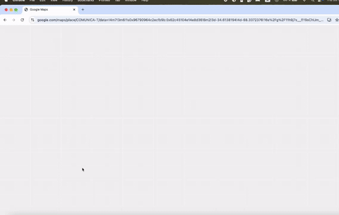

# 🗺️ Google Maps Scraper - Guía Completa

Script profesional de web scraping para Google Maps que replica la estrategia utilizada por Apify.

## 🎬 Demo



---

## 📑 Tabla de Contenidos

1. [Características](#-características)
2. [Instalación](#-instalación)
3. [Composición del Programa](#-composición-del-programa)
4. [Cómo Usar el Programa](#-cómo-usar-el-programa)
5. [Configuración](#-configuración)
6. [Datos Extraídos](#-datos-extraídos)
7. [Pausa y Reanudación](#-pausa-y-reanudación)
8. [Solución de Problemas](#-solución-de-problemas)
9. [Archivos Generados](#-archivos-generados)
10. [Consideraciones Importantes](#-consideraciones-importantes)

---

## 🎯 Características

- **Geolocalización inteligente**: Convierte ubicaciones textuales en polígonos usando Nominatim
- **División geográfica**: Divide el área en segmentos para cobertura completa
- **Búsqueda multi-rubro**: Busca múltiples categorías de negocios
- **Scroll infinito**: Maneja la paginación automática de Google Maps
- **Anti-detección**: Usa undetected-chromedriver y comportamiento humano
- **Checkpoints automáticos**: Guarda progreso cada 20 empresas
- **Sistema de Pausa**: Presiona Ctrl+C para pausar de forma segura
- **Campos N/A**: Distingue campos vacíos de no buscados
- **Logs detallados**: Sistema de logging estilo Apify
- **Recuperación de errores**: Puede retomar desde donde se quedó

---

## 🛠️ Instalación

### Requisitos previos

- **Python 3.8+** instalado
- **Google Chrome** instalado
- **Git** (opcional, para clonar el proyecto)

### Paso 1: Crear entorno virtual

```bash
# Navegar al directorio del proyecto
cd Scraper_Maps

# Crear entorno virtual
python3 -m venv scraper

# Activar entorno virtual
# En macOS/Linux:
source scraper/bin/activate

# En Windows:
scraper\Scripts\activate
```

**✅ Verás `(scraper)` al inicio de tu línea de comandos cuando esté activado.**

### Paso 2: Instalar dependencias

```bash
pip install -r requirements.txt
```

### Paso 3: Verificar instalación

```bash
python -c "import selenium; import undetected_chromedriver; print('✅ Todo OK')"
```

Si ves `✅ Todo OK`, estás listo para continuar.

---

## 🏗️ Composición del Programa

### Archivos Python Principales

El programa está compuesto por **7 archivos críticos** que trabajan juntos:

#### 1. **`main.py`** - Orquestador Principal
- **Función**: Punto de entrada del programa
- **Importa**: config, utils, geolocator, segment_searcher, data_manager
- **Uso**: `python main.py`

#### 2. **`config.py`** - Configuración Central
- **Función**: Define ubicaciones, rubros, selectores CSS, delays
- **Es usado por**: main.py, segment_searcher.py, detail_extractor.py, completar_telefonos.py
- **Personalizable**: Modifica este archivo para cambiar configuración por defecto

#### 3. **`geolocator.py`** - Geolocalización
- **Función**: Convierte ubicaciones (ej: "Córdoba, Argentina") en coordenadas y polígonos
- **API**: Usa Nominatim de OpenStreetMap
- **Divide**: El área en segmentos para cobertura completa

#### 4. **`segment_searcher.py`** - Buscador de Segmentos
- **Función**: Realiza búsquedas en Google Maps por segmento
- **Maneja**: Scroll infinito, paginación, extracción de resultados
- **Usa**: detail_extractor para obtener datos de cada negocio

#### 5. **`detail_extractor.py`** - Extractor de Detalles
- **Función**: Extrae datos de cada negocio (teléfono, web, email, etc.)
- **Sistema N/A**: Marca como "N/A" cuando no encuentra un dato
- **Limpieza**: Normaliza y limpia los datos extraídos

#### 6. **`data_manager.py`** - Gestor de Datos
- **Función**: Maneja almacenamiento, checkpoints y exportación
- **Evita duplicados**: Usa hash único por negocio
- **Exporta**: A Excel (.xlsx) y CSV

#### 7. **`utils.py`** - Utilidades Comunes
- **Función**: Funciones auxiliares (logging, delays, guardado de estado)
- **Es usado por**: Todos los módulos anteriores

### Archivos Python Auxiliares (Independientes)

#### 8. **`completar_telefonos.py`** - Completar Datos Faltantes
```bash
python completar_telefonos.py
```
Script independiente para volver a buscar teléfonos en registros que tengan "N/A".

#### 9. **`analizar_resultados.py`** - Análisis de Resultados
```bash
python analizar_resultados.py
```
Genera reportes y estadísticas de los datos extraídos.

#### 10. **`utils_cli.py`** - Herramientas CLI
Utilidades de línea de comandos para gestión del proyecto.

#### 11. **`config_example.py`** - Ejemplos de Configuración
Archivo de referencia con ejemplos de configuración.

### Diagrama de Dependencias

```
main.py (★ PRINCIPAL)
├── config.py
├── utils.py
├── geolocator.py
├── segment_searcher.py
│   ├── config.py
│   ├── utils.py
│   └── detail_extractor.py
│       ├── config.py
│       └── utils.py
└── data_manager.py
    └── utils.py
```

### Estructura de Directorios

```
Scraper_Maps/
├── main.py                      # ★ Script principal
├── config.py                    # ★ Configuración
├── geolocator.py               # ★ Geolocalización
├── segment_searcher.py         # ★ Búsqueda
├── detail_extractor.py         # ★ Extracción
├── data_manager.py             # ★ Gestión de datos
├── utils.py                    # ★ Utilidades
├── completar_telefonos.py      # Script auxiliar
├── analizar_resultados.py      # Script auxiliar
├── utils_cli.py                # Script auxiliar
├── config_example.py           # Referencia
├── requirements.txt            # Dependencias
├── README.md                   # Este archivo
├── resultados/                 # Archivos Excel/CSV generados
│   ├── google_maps_results.xlsx
│   └── google_maps_results.csv
├── backups/                    # Backups automáticos
├── logs/                       # Logs de ejecución
├── estado_ejecucion.json      # ⭐ Estado para recuperación (EN GITHUB)
└── cookies.pkl                # Cookies de sesión
```

---

## 🚀 Cómo Usar el Programa

### Paso 1: Activar el Entorno Virtual

**IMPORTANTE**: Siempre que vayas a usar el programa, primero activa el entorno virtual:

```bash
# En macOS/Linux:
source scraper/bin/activate

# En Windows:
scraper\Scripts\activate
```

Verás `(scraper)` al inicio de tu terminal cuando esté activado.

### Paso 2: Ejecutar el Scraper

#### Opción A: Uso Básico (con config.py)

```bash
python main.py
```

Esto usará la configuración definida en `config.py`:
- Ubicación por defecto
- Rubros por defecto
- Grid size por defecto

#### Opción B: Personalizar desde Línea de Comandos

```bash
# Cambiar ubicación
python main.py --ubicacion "Buenos Aires, Argentina"

# Cambiar rubros
python main.py --rubros "restaurante" "hotel" "gimnasio"

# Cambiar tamaño de grid (1=1x1, 2=2x2, 3=3x3, etc.)
python main.py --grid-size 2

# Modo headless (sin ventana visible)
python main.py --headless

# Combinación completa
python main.py --ubicacion "Rosario, Argentina" --rubros "fabrica" "logistica" --grid-size 2
```

### Ejemplos Prácticos

#### Ejemplo 1: Buscar restaurantes en Buenos Aires
```bash
python main.py --ubicacion "Buenos Aires, Argentina" --rubros "restaurante" "bar" "cafetería"
```

#### Ejemplo 2: Buscar fábricas en Córdoba (cobertura 2x2)
```bash
python main.py --ubicacion "Córdoba, Argentina" --rubros "fabrica" "industria" --grid-size 2
```

#### Ejemplo 3: Búsqueda exhaustiva (cobertura 3x3)
```bash
python main.py --ubicacion "Mendoza, Argentina" --rubros "hotel" "restaurante" --grid-size 3
```

### Paso 3: Monitorear el Progreso

El programa muestra logs en tiempo real:

```
2024-01-24T10:30:00 INFO  📡 Geolocalizando: Córdoba, Argentina
2024-01-24T10:30:02 INFO  ✅ Ubicación encontrada
2024-01-24T10:30:02 INFO  📐 Dividiendo área en cuadrícula de 2x2
2024-01-24T10:30:02 INFO  ✅ Creados 4 segmentos
2024-01-24T10:30:05 INFO  🔍 Buscando 'fabrica' en segmento 0
2024-01-24T10:30:45 INFO  🔍 [fabrica][-31.4201|-64.1888][SCROLL: 8]: Search page scraped: 42 unique, 5 duplicate
2024-01-24T10:30:45 INFO  📊 42 lugares agregados (Total: 42)
```

**Para ver logs en tiempo real en otra terminal:**
```bash
tail -f logs/scraper_*.log
```

### Paso 4: Ver Resultados

Los resultados se guardan automáticamente en:
- **Excel principal**: `resultados/google_maps_results.xlsx`
- **CSV**: `resultados/google_maps_results.csv`
- **Backups**: `backups/backup_TIMESTAMP.xlsx`

Puedes abrir estos archivos mientras el programa está ejecutando.

### Paso 5: Desactivar el Entorno Virtual (cuando termines)

```bash
deactivate
```

---

## ⚙️ Configuración

### Método 1: Editar `config.py`

Abre `config.py` con tu editor favorito y modifica:

```python
CONFIG = {
    # Ubicación a scrapear
    'ubicacion': "Córdoba, Argentina",
    
    # Rubros/categorías a buscar
    'rubros': ["fabrica", "logistica", "transportes"],
    
    # Tamaño de la cuadrícula (2 = 2x2 = 4 segmentos)
    'grid_size': 2,
    
    # Nivel de zoom en Google Maps
    'zoom_level': 13,
    
    # Guardar checkpoint cada N empresas
    'checkpoint_cada': 20,
    
    # Delays entre acciones (segundos)
    'delays': {
        'entre_segmentos': (8, 15),
        'entre_rubros': (4, 8),
        'despues_scroll': (2, 4),
        'despues_click': (1, 2)
    },
    
    # Límites de seguridad
    'max_scrolls': 20,
    'max_empresas_por_dia': 2000,
    
    # Configuración del navegador
    'headless': False,  # True = sin ventana visible
    'user_data_dir': None
}
```

### Método 2: Argumentos de Línea de Comandos

```bash
python main.py --help
```

Muestra todas las opciones disponibles:
- `--ubicacion`: Ubicación a scrapear
- `--rubros`: Lista de rubros
- `--grid-size`: Tamaño de cuadrícula (1, 2, 3, 4...)
- `--headless`: Modo sin ventana visible

---

## 📊 Datos Extraídos

Para cada negocio/lugar extrae:

| Campo | Descripción | Ejemplo |
|-------|-------------|---------|
| `nombre` | Nombre del lugar | "Restaurante El Buen Sabor" |
| `direccion` | Dirección completa | "Av. Colón 123, Córdoba" |
| `categoria` | Categoría del negocio | "Restaurante" |
| `rating` | Puntuación | "4.5" |
| `num_resenas` | Número de reseñas | "127" |
| `telefono` | Teléfono | "+54 351 123-4567" o "N/A" |
| `sitio_web` | Sitio web | "www.ejemplo.com" o "N/A" |
| `email` | Email | "info@ejemplo.com" o "N/A" |
| `url_google_maps` | URL de Google Maps | "https://maps.google.com/..." |
| `latitud` | Coordenada latitud | "-31.4201" |
| `longitud` | Coordenada longitud | "-64.1888" |
| `rubro_buscado` | Rubro que se buscó | "fabrica" |
| `segmento_id` | ID del segmento | "0" |
| `fecha_extraccion` | Fecha y hora | "2024-01-24 10:30:00" |

### Sistema N/A

El programa distingue entre:
- **"N/A"**: El dato fue buscado pero NO se encontró
- **Vacío**: El dato no fue buscado todavía

Esto es útil para saber qué datos realmente no existen vs. cuáles faltan procesar.

---

## ⏸️ Pausa y Reanudación

### Pausar el Scraper

**Presiona `Ctrl+C` UNA SOLA VEZ** en la terminal donde está ejecutando el programa.

```
⏸️  PAUSA SOLICITADA - Guardando estado...
El scraper se detendrá después de completar el elemento actual.
NO presiones Ctrl+C nuevamente, espera a que termine de guardar.
```

El programa:
1. Termina de procesar el elemento actual
2. Guarda todos los datos
3. Guarda el estado en `estado_ejecucion.json`
4. Se cierra limpiamente

### Reanudar el Scraper

Simplemente ejecuta de nuevo:

```bash
python main.py
```

El programa:
1. Detecta el archivo `estado_ejecucion.json`
2. Carga el progreso anterior
3. **Continúa EXACTAMENTE donde se quedó**
4. **NO repite rubros ya procesados**

### 🖥️ Continuar desde Otra Computadora

**IMPORTANTE**: El archivo `estado_ejecucion.json` está en GitHub para permitir portabilidad.

Para continuar el scraping desde otra computadora:

1. **En la computadora original** (donde pausaste):
   ```bash
   # Asegúrate de subir el estado actualizado
   git add estado_ejecucion.json resultados/
   git commit -m "Actualizar estado de ejecución"
   git push origin main
   ```

2. **En la computadora nueva**:
   ```bash
   # Clonar el repositorio
   git clone https://github.com/panasabena/Google_Maps_Scraper.git
   cd Google_Maps_Scraper
   
   # Activar entorno virtual e instalar dependencias
   python3 -m venv scraper
   source scraper/bin/activate
   pip install -r requirements.txt
   
   # Ejecutar - continuará automáticamente desde donde se quedó
   python main.py
   ```

3. **El programa automáticamente**:
   - Lee `estado_ejecucion.json` del repositorio
   - Carga los 25,000+ registros ya extraídos
   - **NO repite ubicaciones/rubros completados**
   - Continúa con los rubros/segmentos pendientes

### Empezar desde Cero

Si quieres comenzar una nueva extracción desde el principio:

```bash
rm estado_ejecucion.json
rm resultados/*.xlsx
rm resultados/*.csv
python main.py
```

---

## 🐛 Solución de Problemas

### Error: "ModuleNotFoundError: No module named 'X'"

**Causa**: El entorno virtual no está activado o las dependencias no están instaladas.

**Solución**:
```bash
source scraper/bin/activate  # Activar entorno
pip install -r requirements.txt  # Instalar dependencias
```

### Error: "ChromeDriver not found" o "Chrome not found"

**Causa**: Google Chrome no está instalado.

**Solución**:
- **macOS**: Descarga desde https://www.google.com/chrome/
- **Linux**: `sudo apt install google-chrome-stable`
- **Windows**: Descarga desde https://www.google.com/chrome/

### Error: "Shapely no funciona"

**Causa**: Falta librería GEOS del sistema.

**Solución**:
```bash
# En macOS
brew install geos

# En Ubuntu/Debian
sudo apt-get install libgeos-dev

# Reinstalar Shapely
pip uninstall shapely
pip install shapely --no-binary shapely
```

### El navegador se cierra inmediatamente

**Posibles causas**:
1. Chrome no está instalado correctamente
2. Problema con undetected-chromedriver
3. Error en la configuración

**Solución**:
```bash
# Ejecutar sin headless para ver qué pasa
python main.py  # Sin --headless

# Verificar logs
cat logs/scraper_*.log
```

### No se encuentran resultados (0 lugares extraídos)

**Posibles causas**:
1. Ubicación inválida o mal escrita
2. Selectores CSS desactualizados (Google cambió su HTML)
3. Google detectó el scraper
4. Sin conexión a internet

**Solución**:
```bash
# 1. Verificar la ubicación
python main.py --ubicacion "Buenos Aires, Argentina"  # Usar nombre completo

# 2. Verificar conexión
ping google.com

# 3. Aumentar delays en config.py
'delays': {
    'entre_segmentos': (15, 25),  # Aumentar
    'entre_rubros': (8, 15),       # Aumentar
    'despues_scroll': (3, 6)       # Aumentar
}

# 4. Revisar logs
cat logs/scraper_*.log
```

### Error: "selenium.common.exceptions.TimeoutException"

**Causa**: El elemento no se encontró en el tiempo esperado.

**Solución**:
1. Aumentar delays en `config.py`
2. Verificar conexión a internet
3. Ejecutar sin headless para ver qué pasa
4. Los selectores pueden estar desactualizados

### El programa se queda "colgado" en un punto

**Posibles causas**:
1. Scroll infinito sin fin
2. Página cargando muy lento
3. Popup o modal bloqueando

**Solución**:
```bash
# Presiona Ctrl+C para pausar
Ctrl+C

# Revisa los logs
cat logs/scraper_*.log

# Reduce max_scrolls en config.py
'max_scrolls': 10  # En lugar de 20
```

---

## 📁 Archivos Generados

### Archivos de Resultados

#### `resultados/google_maps_results.xlsx`
- Archivo Excel principal con todos los datos
- Se actualiza cada 20 empresas (checkpoint)
- Contiene todas las columnas de datos

#### `resultados/google_maps_results.csv`
- Versión CSV de los resultados
- Mismo contenido que el Excel
- Útil para importar a otras herramientas

#### `backups/backup_YYYYMMDD_HHMMSS.xlsx`
- Backups automáticos con timestamp
- Se crean en cada checkpoint
- Formato: `backup_20240124_103000.xlsx`

### Archivos de Estado

#### `estado_ejecucion.json` ⭐ IMPORTANTE

- **Guarda el progreso completo del scraper**
- **Permite reanudar desde donde se quedó**
- **Esencial para continuar desde otra computadora**
- **Evita repetir 25,000+ registros ya extraídos**
- **Está en GitHub para portabilidad**

**Contenido:**
- Ubicaciones completadas
- Rubros procesados por ubicación
- Segmentos finalizados
- Total de empresas extraídas
- Timestamp del último checkpoint
- Fecha de inicio

**Ejemplo:**
```json
{
  "ubicaciones_completadas": {
    "buenos_aires_argentina": {
      "nombre": "Buenos Aires, Argentina",
      "rubros_completados": [
        "fabrica",
        "logistica",
        "transportes"
      ],
      "segmentos_completados": {
        "seg_0": {
          "rubros": ["fabrica", "logistica"],
          "completado": true
        }
      }
    }
  },
  "empresas_extraidas": 25507,
  "ultimo_checkpoint": "2024-01-26T00:23:00",
  "fecha_inicio": "2024-01-24T09:00:00"
}
```

**💡 Uso entre computadoras:**
1. Commit y push del estado: `git add estado_ejecucion.json && git commit -m "Update" && git push`
2. En otra PC: `git pull` y ejecuta `python main.py`
3. El programa continúa automáticamente sin repetir datos

#### `cookies.pkl`
- Cookies de sesión de Google
- Evita re-autenticación
- Formato pickle (binario)

### Archivos de Logs

#### `logs/scraper_YYYYMMDD_HHMMSS.log`
- Logs detallados de ejecución
- Un archivo por ejecución
- Formato: `scraper_20240124_103000.log`
- Codificación: UTF-8

Ejemplo de logs:
```
2024-01-24T10:30:00 INFO  📡 Iniciando scraper...
2024-01-24T10:30:00 INFO  📍 Ubicación: Córdoba, Argentina
2024-01-24T10:30:00 INFO  🏷️  Rubros: fabrica, logistica
2024-01-24T10:30:02 INFO  ✅ Geolocalización exitosa
2024-01-24T10:30:02 INFO  📐 Creados 4 segmentos
2024-01-24T10:30:05 INFO  🔍 Buscando 'fabrica' en segmento 0
```

---

## ⚠️ Consideraciones Importantes

### Límites de Google Maps

- Google puede detectar y bloquear scraping excesivo
- Usa delays apropiados entre solicitudes
- No ejecutes el script 24/7
- Considera usar la API oficial de Google Places para uso comercial

### Uso Responsable

- Este script es para **fines educativos**
- Respeta los términos de servicio de Google
- No sobrecargues los servidores de Google
- Usa los datos de manera ética

### Anti-Detección

El script incluye:
- ✅ User-Agent rotation
- ✅ Delays aleatorios
- ✅ undetected-chromedriver
- ✅ Comportamiento similar al humano

Aún así, Google puede detectarlo. Para uso en producción considera:
- Proxies rotativos
- Distribución de IPs
- API oficial de Google Places

### Recomendaciones de Uso

#### Por Tamaño de Búsqueda

| Caso de Uso | Grid Size | Rubros | Tiempo Estimado |
|-------------|-----------|--------|-----------------|
| Prueba rápida | 1 (1x1) | 1-2 | 10-20 min |
| Búsqueda normal | 2 (2x2) | 2-3 | 30-60 min |
| Búsqueda exhaustiva | 3 (3x3) | 3-5 | 2-4 horas |
| Muy exhaustiva | 4 (4x4) | 5+ | 4-8 horas |

#### Tips Importantes

1. **Empieza pequeño**: Prueba con 1-2 rubros y grid-size 1 primero
2. **Monitorea los logs**: Te dirán exactamente qué está pasando
3. **Sé paciente**: Google Maps puede ser lento
4. **Usa delays apropiados**: No hagas scraping agresivo
5. **Backups automáticos**: No los borres, son tu seguro
6. **Horarios**: Ejecuta preferiblemente en horarios de bajo tráfico

### Legalidad y Ética

⚠️ **IMPORTANTE**: 

- Este software es para **fines educativos y de investigación**
- El web scraping puede violar los Términos de Servicio de Google
- Google puede bloquear tu IP si detecta actividad de scraping
- Para uso comercial, **usa la API oficial de Google Places**
- Los datos extraídos son de dominio público pero tienen derechos
- Usa bajo tu propia responsabilidad

---

## 📈 Proceso de Ejecución

### Flujo del Programa

```
1. INICIO
   ↓
2. Cargar configuración (config.py o argumentos)
   ↓
3. Inicializar navegador Chrome (undetected-chromedriver)
   ↓
4. GEOLOCALIZACIÓN
   - Consultar Nominatim API
   - Obtener polígono de la ubicación
   - Calcular bounding box
   ↓
5. SEGMENTACIÓN
   - Dividir área en cuadrícula (grid_size x grid_size)
   - Calcular centro de cada segmento
   ↓
6. BÚSQUEDA (por cada segmento)
   - Para cada rubro:
     a. Construir URL de búsqueda
     b. Navegar a Google Maps
     c. Manejar pantallas de consentimiento
     d. SCROLL INFINITO
        - Hacer scroll hacia abajo
        - Esperar carga de elementos
        - Extraer datos de cada lugar
        - Filtrar duplicados
        - Repetir hasta fin de resultados
     e. Guardar datos
   - Checkpoint cada 20 empresas
   ↓
7. EXPORTACIÓN FINAL
   - Crear DataFrame con todos los datos
   - Exportar a Excel (.xlsx)
   - Exportar a CSV (.csv)
   - Crear backup final
   ↓
8. FIN
   - Cerrar navegador
   - Mostrar estadísticas
```

### Tiempo Estimado

```
Por lugar:              ~1-2 segundos
Por página (20 lugares): ~40-80 segundos
Por rubro (100 lugares): ~5-10 minutos
Por segmento (3 rubros): ~15-30 minutos
Total (4 seg, 3 rubros): ~1-2 horas
```

---

## 📞 Soporte y Ayuda

### Revisar Logs

Los logs contienen información detallada de lo que está pasando:

```bash
# Ver último log
cat logs/scraper_*.log | tail -100

# Ver logs en tiempo real
tail -f logs/scraper_*.log

# Buscar errores
grep ERROR logs/scraper_*.log
```

### Verificar Estado

```bash
# Ver archivo de estado
cat estado_ejecucion.json

# Ver resultados parciales
ls -lh resultados/
```

### Limpiar Proyecto

Para empezar desde cero y limpiar todo:

```bash
# Eliminar estado
rm estado_ejecucion.json

# Eliminar resultados
rm -rf resultados/*.xlsx resultados/*.csv

# Eliminar backups
rm -rf backups/*.xlsx

# Eliminar logs antiguos
rm -rf logs/*.log

# Eliminar cookies
rm cookies.pkl
```

---

## 🤝 Mejoras Futuras

Áreas de mejora identificadas:

- [ ] Extracción desde `APP_INITIALIZATION_STATE` (más rápido)
- [ ] Paralelización por segmentos
- [ ] Sistema de proxies rotativos
- [ ] Base de datos (PostgreSQL) en lugar de Excel
- [ ] API REST para control remoto
- [ ] Dashboard web en tiempo real
- [ ] Soporte multi-idioma
- [ ] Detección automática de bloqueos
- [ ] Rate limiting adaptativo
- [ ] Exportación a otros formatos (JSON, SQL, etc.)

---

## 📝 Licencia

Este proyecto es para fines educativos. Usa bajo tu propia responsabilidad.

**NO se ofrece garantía de ningún tipo.**

---

## ✅ Checklist de Uso Rápido

- [ ] Python 3.8+ instalado
- [ ] Google Chrome instalado
- [ ] Entorno virtual creado: `python3 -m venv scraper`
- [ ] Entorno activado: `source scraper/bin/activate`
- [ ] Dependencias instaladas: `pip install -r requirements.txt`
- [ ] Configuración revisada en `config.py`
- [ ] Ejecutar: `python main.py`
- [ ] Monitorear logs: `tail -f logs/scraper_*.log`
- [ ] Revisar resultados en `resultados/google_maps_results.xlsx`

---

**⚡ Happy Scraping!**

---

*Última actualización: Enero 2024*
